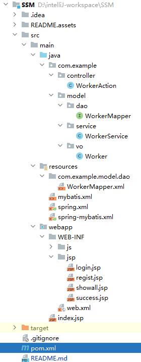
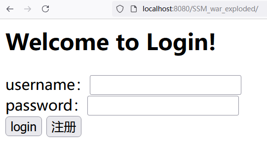
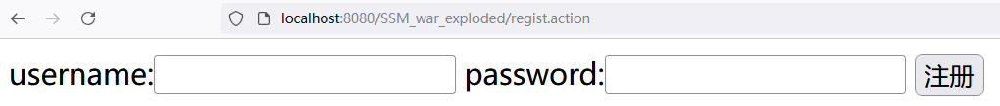
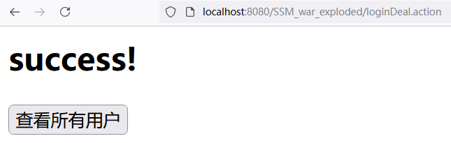
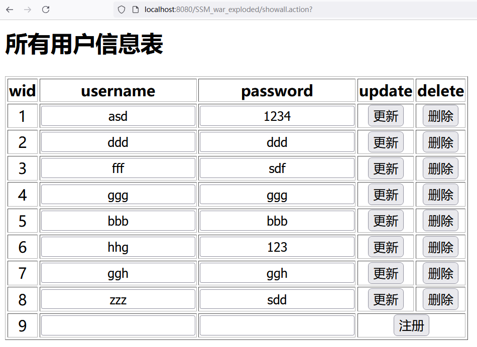

## 最终项目布局：



首页：登录



注册页面：



登陆成功



显示所有用户



更新，删除，注册完成时，立即自动刷新。

## 项目部署

1. git pull到本地

2. IDEA配置Tomcat服务器

3. maven设置为auto-reload，加载配置

4. 数据库mysql，创建数据库springmvc，创建数据表worker，插入一条数据作为登录信息。

   ```sql
   create database springmvc;
   use springmvc;
   create table worker(wid int primary key,username char(20),password char(20));
   desc worker;
   insert into worker value(1,"as","123");
   select * from worker;
   ```

5. 即可启动本项目
